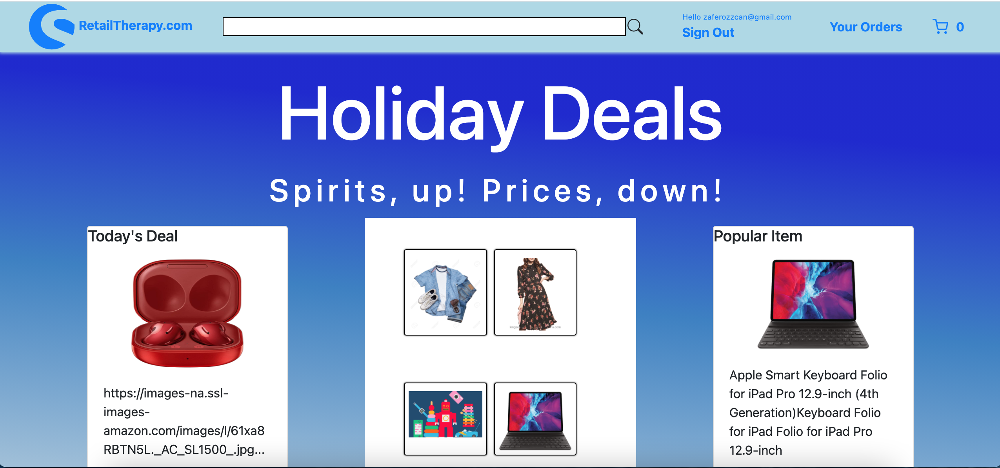
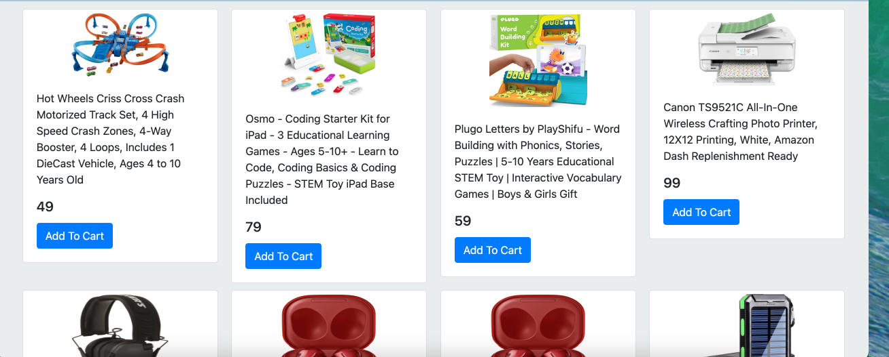
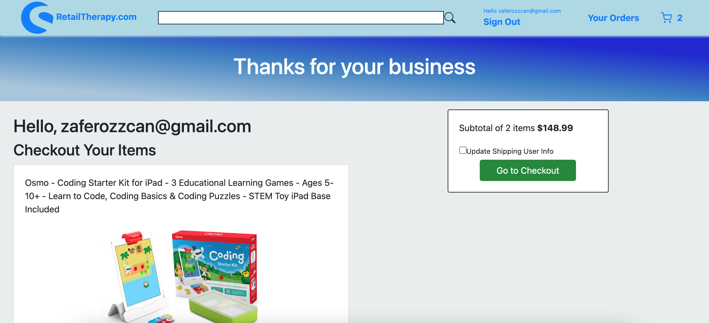
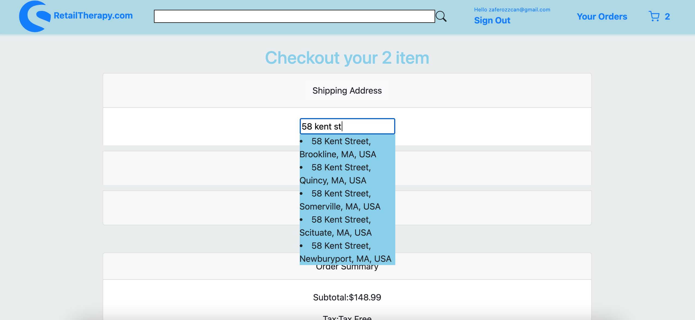
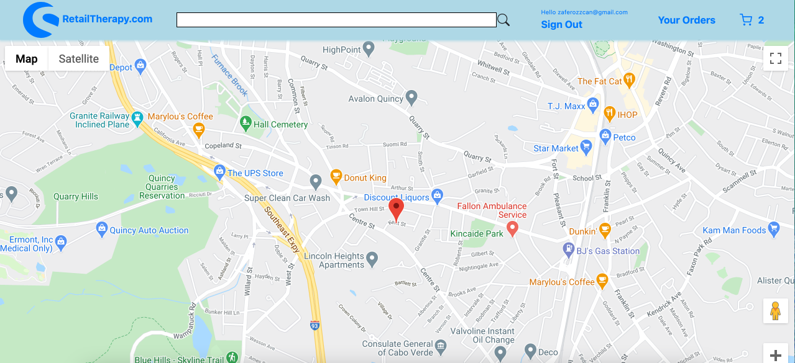

# capstone-full-ecommerce-client

Full Ecommerce App based on React.Js

By Zafer Ozcan

# Front End

Live Site:
Github:

# Back End

Live Site:
GitHub:

RetailTherapy.com is an application where user can perform full shopping experience.
-Client is able to add products to the cart and proceed to checkout.
-Client is able to update his/her cart--removing and editing the cart items.
-Client can update his/her address, as well as see the address on the map.
-Client can add his/her credit cart and update the card number.

# List of Technologies:

- ReactJS.
- Javascript
- Express.js
- RestFul API Services
- Firebase Auth
- Third-Party API (Google Map)
- Cascading Style Sheets(CSS)
- React Bootstrap
- Axios
- React Context API
- React Hooks
- Stripe.js
- Git

# Development process and strategy

# Future feature additions - Unsolved Issues

Deployed application answers entire functionality. In future deployments, some features can be added for a better user Experience, such as:

Provide a help chat popup service- using web sockets
Provide Recommender System for the leverage company's profit

# User stories

- As an unregistered user, I Would like to add items to the cart.
- As an unregistered user, I would like to sign up with email and password yto checkout the cart.
- As a registered user, I would like to sign in with email and password.
- As a signed in user, I would like to sign out.
- As a signed in user, I would to populate my cart.
- As a signed in user, I would to delete and edit my cart items.
- As a signed in user, I would to add my credit cart.
- As a user, I want to see my address on the map.

### Screenshot of the Application

 

 

 

 

### This Application uses three different Restful APIs:

1. Actual database API, which can be found in this link. Make sure to setup this API first and configure to use in your front end.
2. Google Maps API, find the documentation [Here]()
3. Google API, find the documentation [Here](

Fork and clone this repository.

1. Empty README.md and fill with your own content.
2. Replace project name in package.json with your projects name.
3. Replace the "homepage" field in package.json with your Github account name and repository name.
4. Install dependencies with npm install.
5. Get a new Google API KEY from Google Developers Console and change the one in the link, given at the bottom of the App.js file of this repository.
6. Don't forget to enable Google Maps API services from Google Dev. Console as explained in Google Maps API docs.
7. git add and git commit your changes.
8. Run the database api by entering bin/rails server command in shell (in api's directory)
9. Run npm start in shell to start the app
